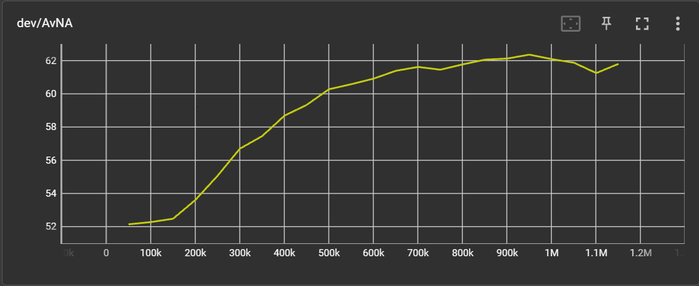
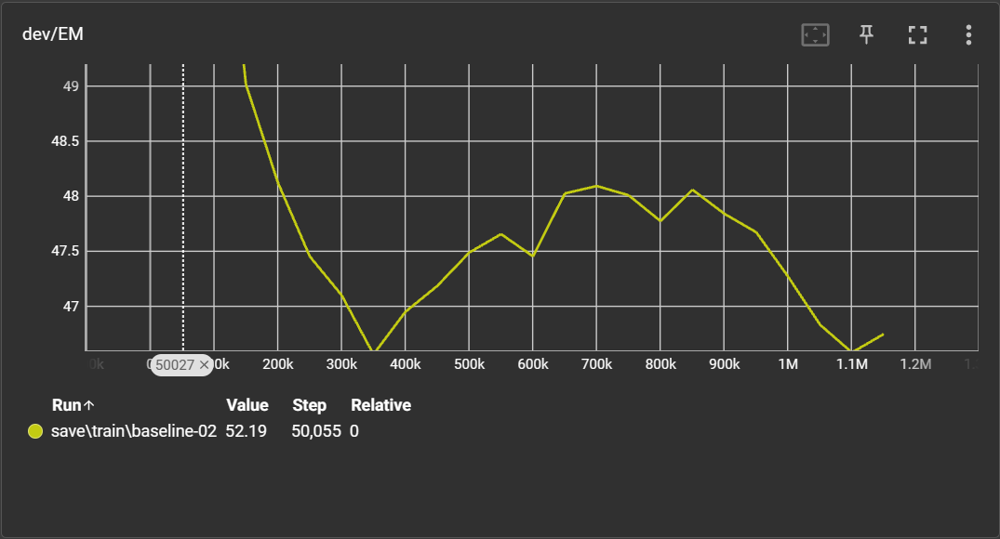
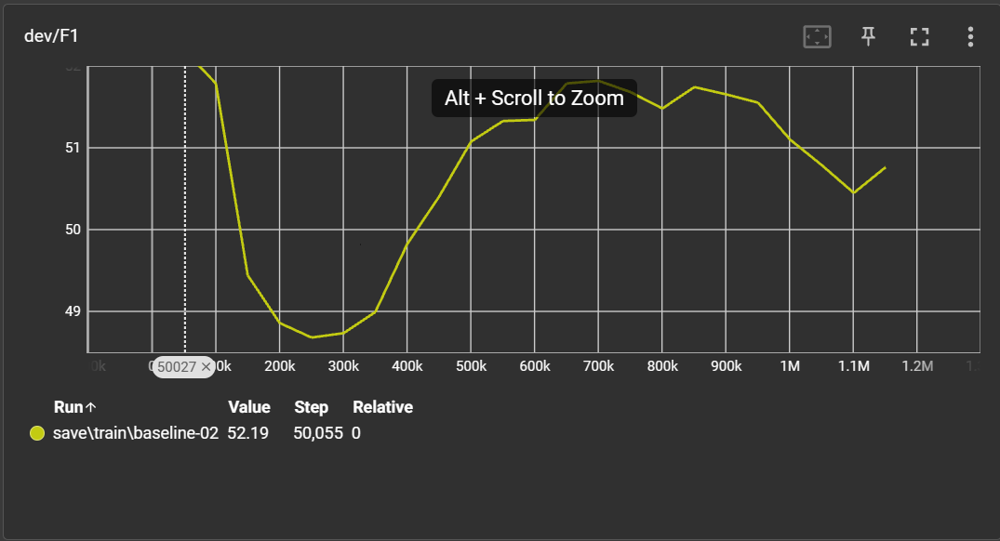

# CS224N default final project (2022 IID SQuAD track) for Text Mining HCMUS

## Setup

1. Make sure you have [Miniconda](https://conda.io/docs/user-guide/install/index.html#regular-installation) installed

   1. Conda is a package manager that sandboxes your project’s dependencies in a virtual environment
   2. Miniconda contains Conda and its dependencies with no extra packages by default (as opposed to Anaconda, which installs some extra packages)

2. cd into src, run `conda env create -f environment.yml`

   1. This creates a Conda environment called `squad`

3. Run `conda activate squad`

   1. This activates the `squad` environment
   2. Do this each time you want to write/test your code

4. Run `python setup.py`

   1. This downloads SQuAD 2.0 training and dev sets, as well as the GloVe 300-dimensional word vectors (840B)
   2. This also pre-processes the dataset for efficient data loading
   3. For a MacBook Pro on the Stanford network, `setup.py` takes around 30 minutes total

5. Browse the code in `train.py`
   1. The `train.py` script is the entry point for training a model. It reads command-line arguments, loads the SQuAD dataset, and trains a model.
   2. You may find it helpful to browse the arguments provided by the starter code. Either look directly at the `parser.add_argument` lines in the source code, or run `python train.py -h`.

## Project

1. `args.py`: Command-line arguments for [traning],[testing], [setup]
2. `environment.yml`: List of packages in the conda virtual environment.
3. `layers.py`: layers used in the model.
4. `models.py`: model used for training.
5. `setup.py`: Download Glove Vectore, pre-processing sample.
6. `train.py`: Training.
7. `test.py`: Testing.
8. `util.py`: Utilities functions and classes.
9. `sampling.ipynb`: Sampling from original train dataset ( the output under `train(amount samples).npz` format).

## Arguments

## #setup

usage: Download and pre-process SQuAD [-h] [--train_record_file TRAIN_RECORD_FILE] [--dev_record_file DEV_RECORD_FILE]
[--test_record_file TEST_RECORD_FILE] [--word_emb_file WORD_EMB_FILE] [--char_emb_file CHAR_EMB_FILE]
[--train_eval_file TRAIN_EVAL_FILE] [--dev_eval_file DEV_EVAL_FILE] [--test_eval_file TEST_EVAL_FILE]
[--train_url TRAIN_URL] [--dev_url DEV_URL] [--test_url TEST_URL] [--glove_url GLOVE_URL]
[--dev_meta_file DEV_META_FILE] [--test_meta_file TEST_META_FILE] [--word2idx_file WORD2IDX_FILE]
[--char2idx_file CHAR2IDX_FILE] [--answer_file ANSWER_FILE] [--para_limit PARA_LIMIT] [--ques_limit QUES_LIMIT]
[--test_para_limit TEST_PARA_LIMIT] [--test_ques_limit TEST_QUES_LIMIT] [--char_dim CHAR_DIM]
[--glove_dim GLOVE_DIM] [--glove_num_vecs GLOVE_NUM_VECS] [--ans_limit ANS_LIMIT] [--char_limit CHAR_LIMIT]
[--include_test_examples INCLUDE_TEST_EXAMPLES]

optional arguments:
-h, --help show this help message and exit
--train_record_file TRAIN_RECORD_FILE
--dev_record_file DEV_RECORD_FILE
--test_record_file TEST_RECORD_FILE
--word_emb_file WORD_EMB_FILE
--char_emb_file CHAR_EMB_FILE
--train_eval_file TRAIN_EVAL_FILE
--dev_eval_file DEV_EVAL_FILE
--test_eval_file TEST_EVAL_FILE
--train_url TRAIN_URL
--dev_url DEV_URL
--test_url TEST_URL
--glove_url GLOVE_URL
--dev_meta_file DEV_META_FILE
--test_meta_file TEST_META_FILE
--word2idx_file WORD2IDX_FILE
--char2idx_file CHAR2IDX_FILE
--answer_file ANSWER_FILE
--para_limit PARA_LIMIT
Max number of words in a paragraph
--ques_limit QUES_LIMIT
Max number of words to keep from a question
--test_para_limit TEST_PARA_LIMIT
Max number of words in a paragraph at test time
--test_ques_limit TEST_QUES_LIMIT
Max number of words in a question at test time
--char_dim CHAR_DIM Size of char vectors (char-level embeddings)
--glove_dim GLOVE_DIM
Size of GloVe word vectors to use
--glove_num_vecs GLOVE_NUM_VECS
Number of GloVe vectors
--ans_limit ANS_LIMIT
Max number of words in a training example answer
--char_limit CHAR_LIMIT
Max number of chars to keep from a word
--include_test_examples INCLUDE_TEST_EXAMPLES
Process examples from the test set

## #training

usage: Train a model on SQuAD [-h] [--train_record_file TRAIN_RECORD_FILE] [--dev_record_file DEV_RECORD_FILE] [--test_record_file TEST_RECORD_FILE]
[--word_emb_file WORD_EMB_FILE] [--char_emb_file CHAR_EMB_FILE] [--train_eval_file TRAIN_EVAL_FILE]
[--dev_eval_file DEV_EVAL_FILE] [--test_eval_file TEST_EVAL_FILE] --name NAME [--max_ans_len MAX_ANS_LEN]
[--num_workers NUM_WORKERS] [--save_dir SAVE_DIR] [--batch_size BATCH_SIZE] [--use_squad_v2 USE_SQUAD_V2]
[--hidden_size HIDDEN_SIZE] [--num_visuals NUM_VISUALS] [--load_path LOAD_PATH] [--eval_steps EVAL_STEPS] [--lr LR]
[--l2_wd L2_WD] [--num_epochs NUM_EPOCHS] [--drop_prob DROP_PROB] [--metric_name {NLL,EM,F1}]
[--max_checkpoints MAX_CHECKPOINTS] [--max_grad_norm MAX_GRAD_NORM] [--seed SEED] [--ema_decay EMA_DECAY]

optional arguments:
-h, --help show this help message and exit
--train_record_file TRAIN_RECORD_FILE
--dev_record_file DEV_RECORD_FILE
--test_record_file TEST_RECORD_FILE
--word_emb_file WORD_EMB_FILE
--char_emb_file CHAR_EMB_FILE
--train_eval_file TRAIN_EVAL_FILE
--dev_eval_file DEV_EVAL_FILE
--test_eval_file TEST_EVAL_FILE
--name NAME, -n NAME Name to identify training or test run.
--max_ans_len MAX_ANS_LEN Maximum length of a predicted answer.
--num_workers NUM_WORKERS Number of sub-processes to use per data loader.
--save_dir SAVE_DIR Base directory for saving information.
--batch_size BATCH_SIZE Batch size per GPU. Scales automatically when multiple GPUs are available.
--use_squad_v2 USE_SQUAD_V2 Whether to use SQuAD 2.0 (unanswerable) questions.
--hidden_size HIDDEN_SIZE Number of features in encoder hidden layers.
--num_visuals NUM_VISUALS Number of examples to visualize in TensorBoard.
--load_path LOAD_PATH Path to load as a model checkpoint.
--eval_steps EVAL_STEPS Number of steps between successive evaluations.
--lr LR Learning rate.
--l2_wd L2_WD L2 weight decay.
--num_epochs NUM_EPOCHS Number of epochs for which to train. Negative means forever.
--drop_prob DROP_PROB Probability of zeroing an activation in dropout layers.
--metric_name {NLL,EM,F1} Name of dev metric to determine best checkpoint.
--max_checkpoints MAX_CHECKPOINTS Maximum number of checkpoints to keep on disk.
--max_grad_norm MAX_GRAD_NORM Maximum gradient norm for gradient clipping.
--seed SEED Random seed for reproducibility.
--ema_decay EMA_DECAY Decay rate for exponential moving average of parameters.

# Testing

---

usage: Test a trained model on SQuAD [-h] [--train_record_file TRAIN_RECORD_FILE] [--dev_record_file DEV_RECORD_FILE] [--test_record_file TEST_RECORD_FILE]
[--word_emb_file WORD_EMB_FILE] [--char_emb_file CHAR_EMB_FILE] [--train_eval_file TRAIN_EVAL_FILE]
[--dev_eval_file DEV_EVAL_FILE] [--test_eval_file TEST_EVAL_FILE] --name NAME [--max_ans_len MAX_ANS_LEN]
[--num_workers NUM_WORKERS] [--save_dir SAVE_DIR] [--batch_size BATCH_SIZE] [--use_squad_v2 USE_SQUAD_V2]
[--hidden_size HIDDEN_SIZE] [--num_visuals NUM_VISUALS] [--load_path LOAD_PATH] [--split {train,dev,test}]
[--sub_file SUB_FILE]

optional arguments:
-h, --help show this help message and exit
--train_record_file TRAIN_RECORD_FILE
--dev_record_file DEV_RECORD_FILE
--test_record_file TEST_RECORD_FILE
--word_emb_file WORD_EMB_FILE
--char_emb_file CHAR_EMB_FILE
--train_eval_file TRAIN_EVAL_FILE
--dev_eval_file DEV_EVAL_FILE
--test_eval_file TEST_EVAL_FILE
--name NAME, -n NAME Name to identify training or test run.
--max_ans_len MAX_ANS_LEN
Maximum length of a predicted answer.
--num_workers NUM_WORKERS
Number of sub-processes to use per data loader.
--save_dir SAVE_DIR Base directory for saving information.
--batch_size BATCH_SIZE
Batch size per GPU. Scales automatically when multiple GPUs are available.
--use_squad_v2 USE_SQUAD_V2
Whether to use SQuAD 2.0 (unanswerable) questions.
--hidden_size HIDDEN_SIZE
Number of features in encoder hidden layers.
--num_visuals NUM_VISUALS
Number of examples to visualize in TensorBoard.
--load_path LOAD_PATH
Path to load as a model checkpoint.
--split {train,dev,test}
Split to use for testing.
--sub_file SUB_FILE Name for submission file.

## Expriment Approach

In this project, considering HCMUS Student for Text Mining, i recommends to using Google Colab to train this baseline model if you dont have a strong enough computer. You can enable CUDA on your Nvidia GPU on local machine to utilize it.
But, it is the other problem that we dont mention here. Link of example Colab in Appendix below.

In the first atemp to train model on Colab. I faced one important issue. That is ,i think this is because the version colab you used, Colab cannot load the large datasset. You can see the execution is suddenly terminated at building dataset step.
So, the first thing to do to train model on Colab - Sampling original train dataset. `train-v2.json` contains about 130K sample to train. That a huge amount.
In `sampling.ipynb`, i have coded some function that can do that, sampling {10K, 20K, 30K, 40K} and share it to my team to experience together. Link of samples below (you can use it as a reference or create a new one):
[Sapmles](https://drive.google.com/drive/folders/1ozRICdlw_mrpaWUSTVFHWHbU8lbrhr0t?usp=sharing)

![Early Stopping] (./img/early-stopping.jpg)

After training on 40K sample, these are score evaluation for BiDAF baseline

from early-stoping above and the displayed of score (we consider F1 score here). The model starts overfitting from about 700Kth step (about 18 epoch)(1 epoch ~ 40K step). So we can choose epoch number is 19-20 epoch to train this subdataset.

## Appendix

1. [Google Colab] (https://colab.research.google.com/drive/1BC9kl2DQjLcJAydv6RV3RjNFBLhwMMyo#scrollTo=5NCg9cFqTLib)
2. Handout project [IID SSQuAD track](https://web.stanford.edu/class/archive/cs/cs224n/cs224n.1224/project/default-final-project-handout-squad-track.pdf)
3. [Practical Methodalogy](https://www.deeplearningbook.org/contents/guidelines.html)
4. [LSTM](https://d2l.ai/chapter_recurrent-modern/lstm.html)
